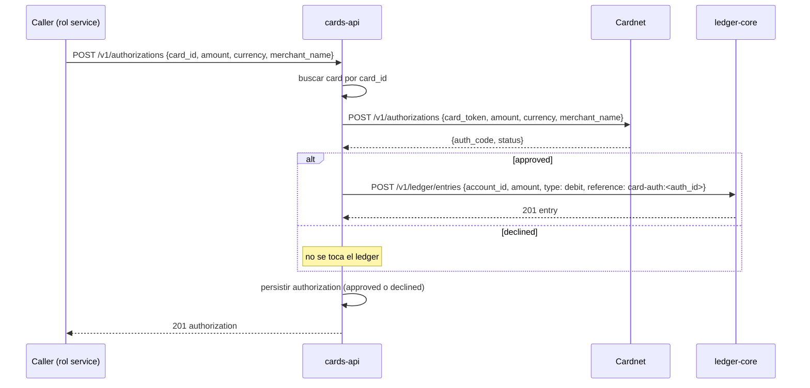

# PCI

Notas de alcance PCI de cards-api. A medias entre Diego y Paula (hardening), así que el tono
cambia de sección en sección — no lo prolijamos, es más útil así que reescrito parejo.

## Qué guardamos

- `card_token`: el identificador que Cardnet nos da de vuelta al emitir la tarjeta
  (`POST /v1/cards/issue`). Es lo que le mandamos de vuelta a Cardnet para autorizar
  (`POST /v1/authorizations`). Vive en `cards.card_token` (`migrations/000001_init.up.sql`).
- `pan_last4`: los últimos 4 dígitos, para mostrar en UI ("terminada en 4242"). No sirve para
  reconstruir el PAN.
- `expiry`: mes/año de vencimiento, formato `MM/YY`.

## Qué NO guardamos, nunca

- El PAN completo. Cardnet lo tiene, nosotros no. Si algún día un endpoint de Cardnet devuelve
  el PAN completo en vez de last4, es un incidente, no un dato más para persistir.
- `card_token` no sale nunca de la base hacia una respuesta HTTP. `GET /v1/cards/{id}` y
  cualquier otro handler que serialice `store.Card` usan el mismo campo (`store.Card.CardToken`,
  `internal/store/store.go`) con tag `json:"-"` — no es una limpieza que cada handler tenga que
  acordarse de hacer, es estructural: el campo no serializa así lo llame quien lo llame. El test
  que lo prueba es `TestGetCard_DoesNotExposeToken` (`internal/http/cards_test.go`).

(Diego) Esto último es la razón por la que el `json:"-"` está en el struct del store y no en un
DTO aparte armado a mano en el handler: un DTO aparte es un lugar más donde alguien puede
olvidarse de omitir el campo al agregar un endpoint nuevo. Acá no hay nada que recordar.

## Rotación del secret del processor

`CARDNET_API_KEY` vive en el Secret `cards-api-secrets` (key `cardnet_api_key`), un valor por
entorno. Terraform lo crea con un valor dummy (todavía no hay integración real con Cardnet fuera
del sandbox del lab) — la rotación real, cuando la haya, es: nueva key del lado de Cardnet,
actualizar el Secret en el entorno, restart del Deployment (no hot-reload, el proceso la lee una
sola vez al arrancar). Sin ventana de mantenimiento porque hay más de un replica en prod
(`deploy/values-prod.yaml`, `replicaCount: 2`) y el rollout de Helm es rolling por default.

(Paula) Falta automatizar esto — hoy es manual y depende de que alguien se acuerde. Lo dejo
anotado para cuando prioricemos hardening de nuevo.

## Quién tiene acceso al namespace

El Deployment lleva la anotación `cauri.io/pci-scope: "true"` (`deploy/chart/templates/deployment.yaml`)
para que quede claro en cualquier vista del clúster que este workload toca datos en alcance PCI,
aunque sea solo token + last4. Acceso de namespace sigue las reglas generales de la org — no hay
nada especial de cards-api en RBAC todavía, es el annotation el que marca la superficie para
quien audite.

## Flujo de autorización

